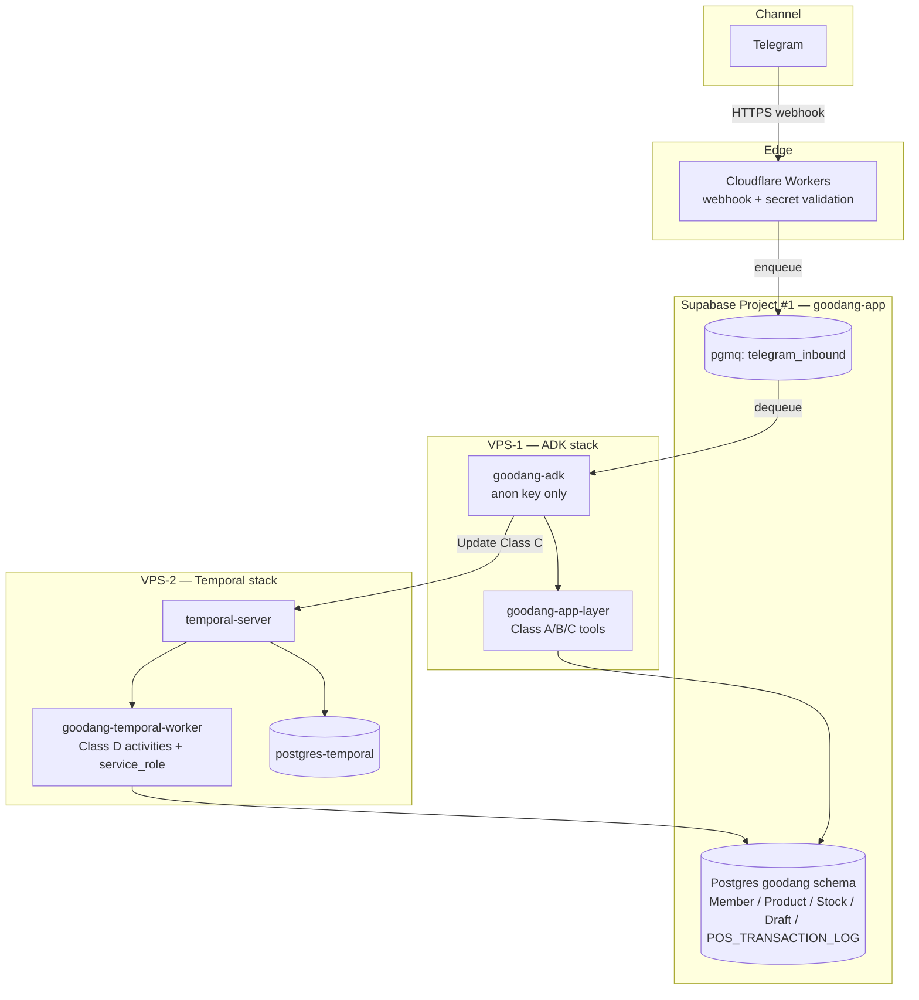

# Goodang Agent

Autonomous Customer Service Agent for **Goodang** — specification, contracts, and foundation tooling for a Telegram-based ordering assistant.

**Channel:** Telegram  
**Primary workflow:** CS Goodang — Guru Ingin Pesan  
**Stack:** [Google ADK](https://adk.dev/) + [Temporal](https://docs.temporal.io/) + Supabase + VPS  
**Repository status:** Fase 1 Foundation — **specification-only** (no runtime Python implementation yet)

---

## What This Repository Is

This repo is the **single source of truth** for building Goodang's autonomous CS agent. It contains:

| Area | Contents |
|------|----------|
| **Contracts** | Canonical names for states, tools, activities, events, error codes, schema fields |
| **Specifications** | ADK, Temporal, Telegram, data, evaluation, infrastructure |
| **Architecture** | ADRs, deployment topology, Supabase schema, CI/branch protection |
| **Guardrails** | GitHub Actions, CodeRabbit rules, drift-check scripts |
| **Templates** | Docker Compose (Fase 1), tool registry, eval harness stub |

Runtime code (`app/*.py`, `tests/`, Supabase migrations) will be added in later phases. Mirror copies of key specs also exist under `app/`, `knowledge/`, and `evaluation/` for agent/CI consumption.

---

## Core Principles

```text
AI understands.          System validates.
Temporal executes.       Database records.
Chat ≠ Order ≠ Transaction
```

**Hard rules (non-negotiable):**

- No guessing, no bypass, no direct DB mutation from ADK
- No transaction without explicit customer confirmation
- Temporal is the **authority** for workflow state (19 canonical states in `docs/0` §2)
- Class D mutations (`create_transaction`, `deduct_stock`, `execute_payment`, `write_pos_transaction_log`) run **only** in the Temporal worker — never as unrestricted ADK tools
- `POS_TRANSACTION_LOG` is **append-only** at the database level

---

## Architecture (Fase 1)



**Isolation decisions (see `docs/12. GOODANG_ADR.md`, `docs/13` §2):**

- **Supabase Project #1** (`goodang-app`) — managed Supabase Postgres for app data (`goodang` schema in diagram above)
- **Temporal persistence DB** — **not** in Project #1. Fase 1: dedicated `postgres-temporal` container on **VPS-2** (see diagram). Alternative: Supabase Project #2 or Neon (ADR-002) — same isolation rule, different host
- **goodang-adk** container holds `SUPABASE_ANON_KEY` only — no `service_role`
- **goodang-temporal-worker** holds `SUPABASE_SERVICE_ROLE_KEY` for Class D side-effects against Project #1 only
- Webhook does **not** hit VPS directly — edge → Supabase Queue → ADK consumer

Fase 3 migration path: Temporal Cloud + autoscaling ADK on Cloud Run/Fly.io (`docs/15`).

---

## Request Flow (Happy Path)

```text
1. Guru sends message on Telegram
2. Cloudflare Workers validate webhook secret → enqueue to Supabase Queue
3. goodang-adk dequeues update, classifies intent (ADK + LLM)
4. ADK calls Class A tools (read) via goodang-app-layer:
      identify_customer → search_product → check_stock → get_price → check_payment
5. ADK calls Class B tools (draft mutation):
      create_draft_order → add_order_item → update_order_draft
6. ADK sends Class C workflow command: start_order_workflow → Temporal
7. Temporal drives state machine (docs/6):
      NEW → IDENTIFYING_CUSTOMER → BUILDING_ORDER → … → WAITING_CONFIRMATION
8. Customer confirms (keyword mapping in docs/0 §9)
9. ADK validates confirmation and calls Class C `confirm_order` (Temporal **Update**) → workflow moves to CONFIRMED
10. Temporal runs Class D activities in worker:
      create_transaction → deduct_stock → execute_payment → write_pos_transaction_log
11. State → COMPLETED; ADK sends summary reply to Telegram
```

**On failure / edge cases:** `MODIFICATION_REQUESTED`, `CANCELLED`, `HANDOVER_CS`, `ERROR`, or `EXPIRED` (30 min on `WAITING_CONFIRMATION`).

---

## Tool Classes

Defined canonically in `docs/0. GOODANG_CONTRACT.md` §3 and registered in `app/tools/registry.yaml`.

| Class | Count | Who calls | Examples |
|-------|-------|-----------|----------|
| **A — Read** | 13 | ADK → App Layer | `identify_customer`, `search_product`, `check_stock`, `get_price` |
| **B — Draft** | 4 | ADK → App Layer | `create_draft_order`, `add_order_item`, `remove_order_item` |
| **C — Workflow** | 4 | ADK → Temporal | `start_order_workflow`, `confirm_order`, `cancel_order`, `request_human_handover` |
| **D — Final mutation** | 4 | Temporal worker only | `create_transaction`, `deduct_stock`, `execute_payment`, `write_pos_transaction_log` |

CI enforces: Class D tools must **not** appear in `app/tools/registry.yaml`.

---

## Repository Layout

```text
goodang-agent/
├── docs/                    # Primary specifications (docs/0 = canonical contract)
│   ├── 0. GOODANG_CONTRACT.md          ← START HERE (SoT)
│   ├── 1–11.*                          # Agent, tools, data, Temporal, eval, Telegram
│   ├── 12. GOODANG_ADR.md              # Architecture decisions (ADR-001–010)
│   ├── 13–17.*                         # Infra, Supabase, Temporal deploy, eval harness, CI
│   ├── GOODANG_ADK_PROMPT_SPEC.md
│   ├── rules/                          # CodeRabbit knowledge base (P0 bug rules)
│   └── audit/
├── app/                     # Mirror specs + runtime placeholders (Fase 2+)
│   ├── agents/
│   ├── tools/registry.yaml  # ADK tool allowlist (synced with docs/0 §3)
│   ├── temporal/
│   ├── schemas/
│   └── telegram/
├── knowledge/               # Agent knowledge mirror
├── evaluation/              # Eval harness (stub Fase 1, 150 cases target Fase 2)
├── scripts/                 # CI drift checks, branch protection setup
├── docker/                  # Fase 1 stack template (docker-compose.fase1.yml)
├── supabase/migrations/     # Placeholder (schema spec in docs/14)
├── .github/workflows/       # ci.yml, contract.yml, eval.yml
└── .coderabbit.yaml         # AI pre-review configuration
```

---

## Documentation Index

| Doc | Role |
|-----|------|
| [`docs/0. GOODANG_CONTRACT.md`](docs/0.%20GOODANG_CONTRACT.md) | **Canonical contract** — states, tools, activities, error codes, schema |
| [`docs/1. GOODANG_ADK_AGENT_SPECIFICATION.md`](docs/1.%20GOODANG_ADK_AGENT_SPECIFICATION.md) | Main agent development spec |
| [`docs/6. GOODANG_STATE_MACHINE.md`](docs/6.%20GOODANG_STATE_MACHINE.md) | State transitions (Temporal authority) |
| [`docs/12. GOODANG_ADR.md`](docs/12.%20GOODANG_ADR.md) | Architecture decision records |
| [`docs/13. GOODANG_INFRASTRUCTURE_SPEC.md`](docs/13.%20GOODANG_INFRASTRUCTURE_SPEC.md) | VPS / Supabase / network topology |
| [`docs/14. GOODANG_SUPABASE_SCHEMA_SPEC.md`](docs/14.%20GOODANG_SUPABASE_SCHEMA_SPEC.md) | DDL, RLS, append-only ledger |
| [`docs/15. GOODANG_TEMPORAL_DEPLOYMENT_SPEC.md`](docs/15.%20GOODANG_TEMPORAL_DEPLOYMENT_SPEC.md) | Self-host → Temporal Cloud |
| [`docs/16. GOODANG_EVALUATION_HARNESS_SPEC.md`](docs/16.%20GOODANG_EVALUATION_HARNESS_SPEC.md) | Agent evaluation (≥90% accuracy gate) |
| [`docs/17. GOODANG_CI_BRANCH_PROTECTION_SPEC.md`](docs/17.%20GOODANG_CI_BRANCH_PROTECTION_SPEC.md) | CI pipeline + branch protection |

Full SoT mapping: `docs/0` §12.

---

## Development Phases

Aligned with ENTIGI AI-Driven roadmap (BA-ENT-STR-001):

| Phase | Focus | This repo |
|-------|-------|-----------|
| **Fase 1 — Foundation** | Contracts, infra spec, CI guardrails | **Current** — spec + templates |
| **Fase 2 — MVP** | ADK skeleton, read-only tools, eval harness | `app/*.py`, `tests/`, migrations |
| **Fase 3 — Adopsi** | Draft order + Temporal + confirmation gate | Temporal worker, Telegram live |
| **Fase 4 — AI Native** | Transaction, eval production, Hermes memory | Full stack + `agent_memory` |

---

## CI & Quality Gates

Three-layer review (see `docs/17`):

1. **GitHub Actions** — deterministic hard gate (9 jobs)
2. **CodeRabbit** — AI pre-review via `.coderabbit.yaml` + `docs/rules/`
3. **Human / CODEOWNERS** — final merge approval (org mode); `SOLO=1` for personal repos

### Local verification

```bash
# Contract integrity (duplicate docs, ghost states, forbidden names)
bash scripts/check-contract-drift.sh

# ADK tool registry ↔ docs/0 §3
python3 scripts/check-tool-registry-sync.py

# Supabase migrations ↔ docs/14 (warns if no migrations yet)
python3 scripts/check-schema-sync.py

# Eval harness stub (passes until cases exist)
bash evaluation/run_evals.sh
```

### Branch protection setup

```bash
# Org with Guardian teams
bash scripts/setup-branch-protection.sh owner/goodang-agent

# Personal repo / solo maintainer (CI gate only)
SOLO=1 bash scripts/setup-branch-protection.sh owner/goodang-agent
```

> **Note:** Branch protection on private repos requires GitHub Pro. Public repos work on GitHub Free.

---

## Docker (Fase 1 template)

```bash
cp docker/.env.example docker/.env   # set secrets locally, never commit .env
# VPS-1 (ADK stack)
docker compose -f docker/docker-compose.fase1.yml --profile adk-stack up -d
# VPS-2 (Temporal stack) — run on separate host (ADR-003)
docker compose -f docker/docker-compose.fase1.yml --profile temporal-stack up -d
```

Profiles: `adk-stack`, `temporal-stack`, `observability`. See `docs/13` for topology.

---

## Change Management

Any change to canonical names (state, tool, activity, error code, schema field):

1. Update `docs/0. GOODANG_CONTRACT.md` first
2. Run `scripts/check-contract-drift.sh` and related sync scripts
3. Update referencing docs + `app/tools/registry.yaml` if tools change
4. Commit with prefix `contract:` or `adr:`

---

## References

- [Google ADK](https://adk.dev/)
- [Google Agents CLI](https://google.github.io/agents-cli/guide/development/)
- [Temporal Documentation](https://docs.temporal.io/)
- [CodeRabbit](https://docs.coderabbit.ai/)
- [Supabase](https://supabase.com/docs)

---

**Maintainer:** [agnsptr/goodang-agent](https://github.com/agnsptr/goodang-agent)  
**License:** See repository settings.
